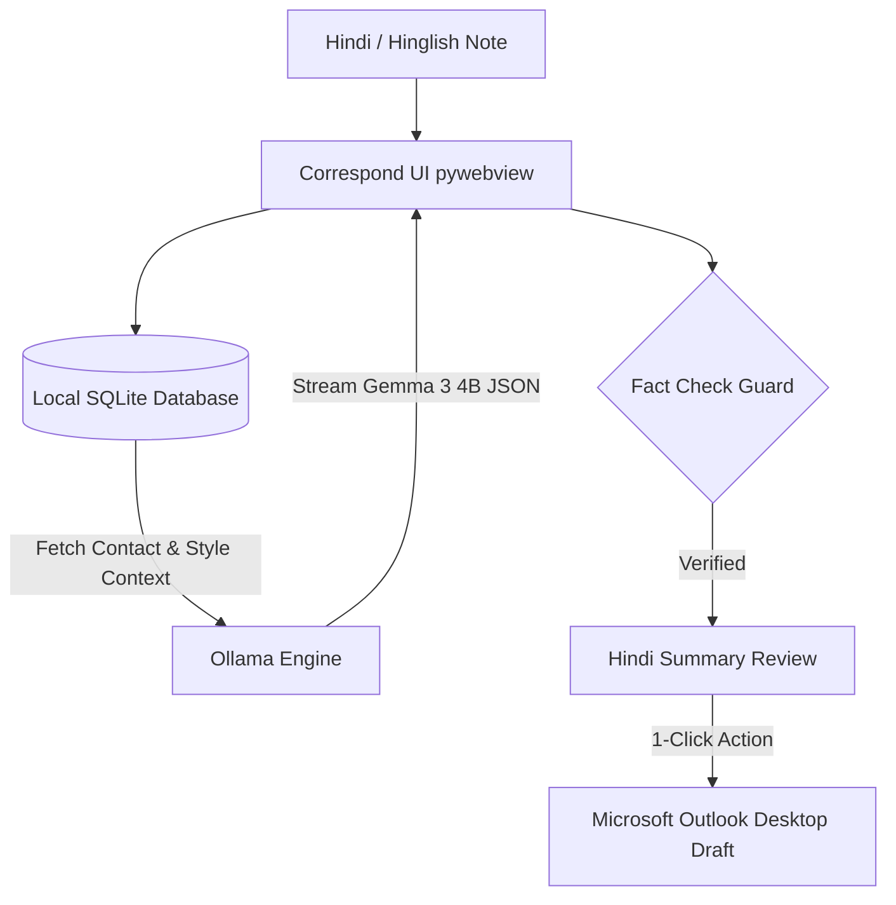

# ✉️ Correspond — Local AI Email Workspace

[](https://ollama.com/library/gemma3:4b)
[](https://ollama.com)
[](https://python.org)
[](https://outlook.office.com)
[](LICENSE)

**Correspond** is a 100% offline, privacy-first desktop email assistant designed to help non-native English speakers draft, refine, and dispatch professional workplace emails. 

Built for the **[Hacktoberfest Weekend Challenge: Build for a Friend](https://dev.to/challenges/hacktoberfest-weekend-2026-10-01)**, it turns quick notes dictated or typed in **Hindi, Hinglish, or informal English** into polished, formal English communications using an on-device **Gemma 3 (4B)** model.

---

## 🎬 Product Demo

[](https://www.youtube.com/watch?v=p8KM_Qgps8M)

> 📺 **Watch the 47s Demo Video**: [youtube.com/watch?v=p8KM_Qgps8M](https://www.youtube.com/watch?v=p8KM_Qgps8M)

---

## ✨ Key Features

- 🗣️ **Hindi & Hinglish Prompting**: Type or dictate notes in natural Hindi/Hinglish (e.g. *"Sharma ji ko mail karo — operations team se glycol readings maango for last week, by Friday 5pm"*).
- 🧠 **On-Device Gemma 3 Intelligence**: Runs `gemma3:4b` locally via Ollama with structured JSON output schemas (`format: json_schema`) for streaming responses.
- 🛡️ **Fact Check Guard**: Cross-verifies explicitly mentioned dates, recipient names, and action items against prompt input to prevent invented commitments or hallucinated numbers.
- 🇮🇳 **Bilingual Confirmation (Hindi Summary)**: Generates a 2-sentence Devanagari Hindi translation summary alongside every email so the user can verify meaning at a glance before sending.
- 📬 **1-Click Native Outlook Drafts**: Seamlessly connects to Microsoft Outlook Desktop via `pywin32` COM bridge to populate draft emails with one click.
- 🔒 **100% Offline & Private**: Zero cloud servers, zero API subscriptions, zero token fees. Email text never leaves the user's laptop.

---

## 🏗️ System Architecture



---

## 🚀 Quickstart Guide

### Prerequisites
1. **Python 3.10 or higher** installed on Windows.
2. **[Ollama](https://ollama.com)** installed and running in the background.
3. **Microsoft Outlook Desktop** (optional, for 1-click draft creation).

### Installation Steps

1. **Clone the Repository**:
   ```bash
   git clone https://github.com/akshatmalik-bruh/email_writer.git
   cd email_writer
   ```

2. **Install Python Dependencies**:
   ```bash
   pip install -r requirements.txt
   ```

3. **Pull the Gemma 3 (4B) Model**:
   ```bash
   ollama pull gemma3:4b
   ```

4. **Launch Correspond**:
   ```bash
   python app.py
   ```

---

## 📁 Repository Structure

```
email_writer/
├── app.py                # Main desktop entry point (pywebview wrapper)
├── requirements.txt      # Python dependencies (pywebview, pywin32, etc.)
├── backend/
│   ├── api.py            # Bridge between UI JS and Python backend
│   ├── db.py             # Local SQLite database manager (contacts, style samples)
│   ├── llm.py            # Local Ollama client & structured Gemma 3 streaming
│   └── outlook.py        # Win32COM Outlook integration helper
├── ui/
│   ├── index.html        # App UI template
│   ├── style.css         # Dark-mode desktop design system
│   └── app.js            # Frontend logic & real-time streaming parser
└── HACKTOBERFEST_SUBMISSION.md  # Hacktoberfest Weekend Challenge Post
```

---

## 🛠️ Stack & Technologies

- **Language & App Shell**: Python 3.10+ / `pywebview`
- **UI Design System**: Vanilla HTML5 / Modern Dark CSS / JavaScript ES6
- **Database**: SQLite3 (on-device local storage)
- **Local AI Engine**: [Ollama](https://ollama.com) running `gemma3:4b`
- **Email Client Bridge**: `pywin32` (`win32com.client`)

---

## 📜 License

Distributed under the MIT License. See `LICENSE` for details.

---

<p align="center">
  Built with ❤️ for <b>Hacktoberfest 2026: Build for a Friend</b>
</p>
